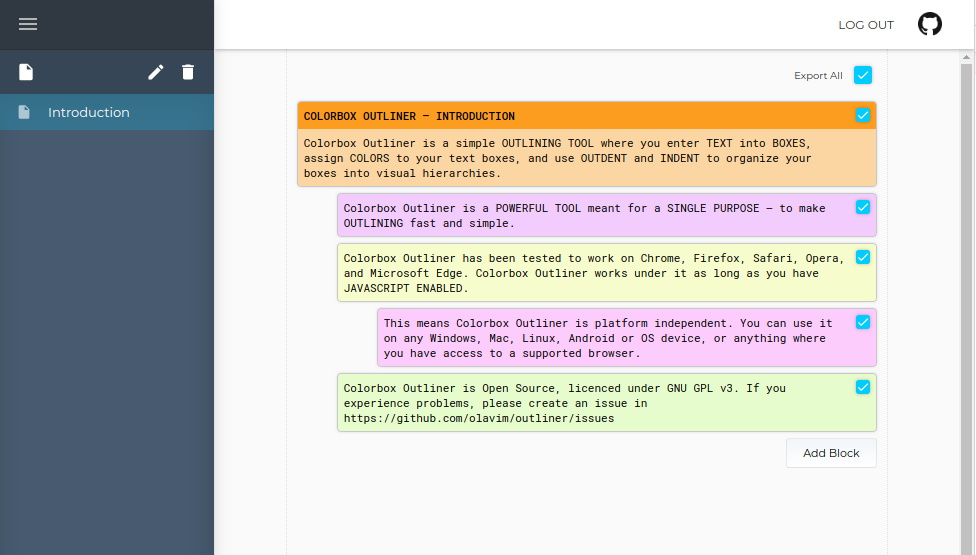
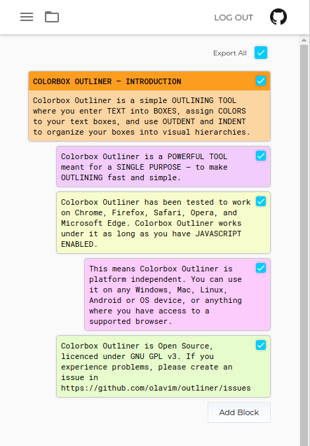

# Colorbox Outliner

A simple outlining web app.

- Add blocks in a column
- A block can have a title and/or a body
- Indent each block as you see fit
- Choose a color for each block
- Export to PDF and text

<p align="center">
  
</p>

<p align="center">
  
</p>

### Development

Download the repository to your machine

```
$ git clone git@github.com:olavim/outliner
```

#### Installation

Install dependencies

with `yarn`:

```
outliner$ yarn
```

with `npm`:

```
outliner$ npm install
```

#### Running

Start the development server with hot module replacement

```
outliner$ yarn dev
```

Alternatively, transpile sources and start server

```
outliner$ yarn build && yarn start
```

By default, the app will be available at http://localhost:3000